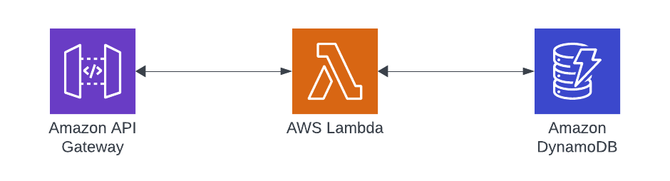

## API Gateway, Lambda, DynamoDB and Rust

Purpose: Showcase using the AWS Rust SDK to build a GET request at a Basic `/{id}` path which queries DynamoDB for a composite key

## Getting Started

### Deploying

First off, install [Node.js](https://nodejs.org/en)

### Dependencies

-   [SAM](https://docs.aws.amazon.com/serverless-application-model/latest/developerguide/install-sam-cli.html)
-   [Rust](https://www.rust-lang.org/tools/install)
-   [Cargo Lambda](https://www.cargo-lambda.info/guide/getting-started.html)

### clone the repository

```bash
cd rust-ddb-api
sam build
sam deploy
```

## Destroying

Simply run:

```bash
sam delete
```

## Implementation

For a further and in-depth review of how to use this repository and what it supports, head on over the [Blog Article](https://www.binaryheap.com/api-gateway-lambda-dynamodb-rust/)

## Design


